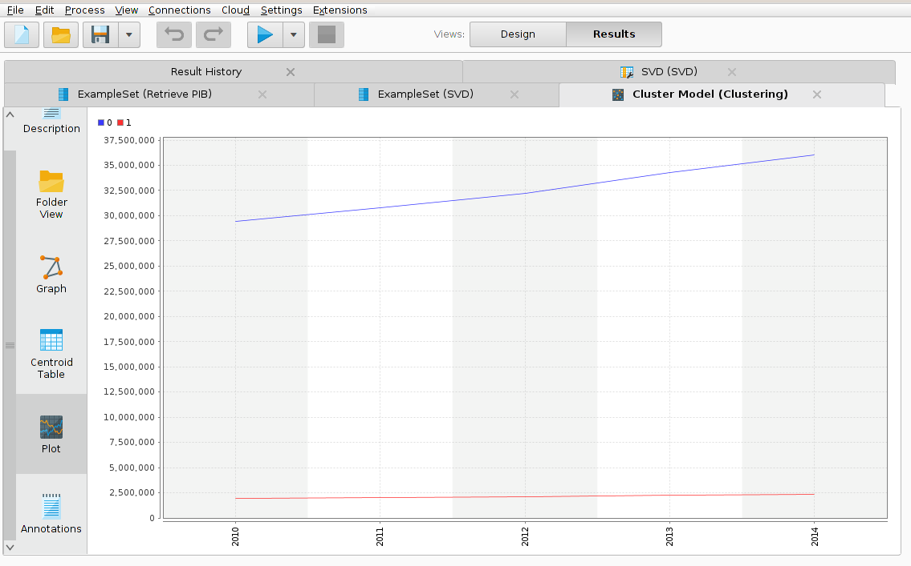

#Resultado 1

En muchos casos, no se puede definir ningún atributo objetivo (etiqueta) y los datos deben ser agrupados automáticamente. Este procedimiento se denomina "Clustering". RapidMiner soporta un amplio rango de esquemas de clustering que se pueden utilizar de la misma forma que cualquier otro esquema de aprendizaje. Esto incluye la combinación con todos los operadores de preprocesamiento.
Para poder apreciar el incremento del producto interior bruto (PIB) en Bolivia agrupamos todos los valores con el algoritmo K-Means y reducimos algunos valores con el operador Singular Value Decomposition.

De esa manera podemos observar el crecimiento  del producto interior bruto (PIB) desde 2010 al 2014.
