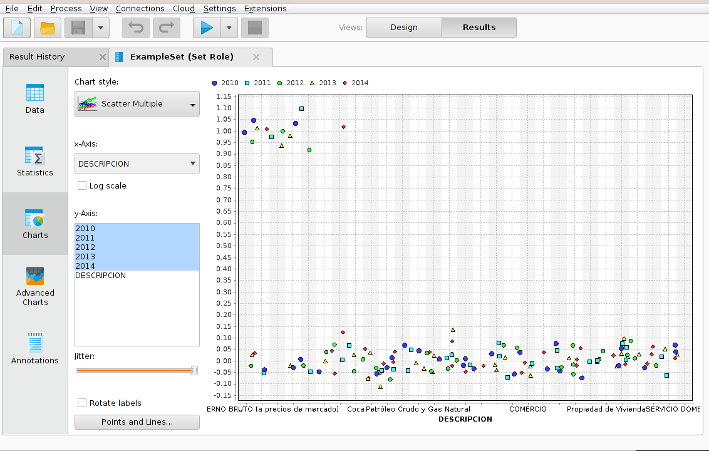

#Resultado 2

Para predecir un resultado en intervalos se utiliza el operador Discretize by Binning. Este operador discretiza los atributos numéricos seleccionados en número especificado por el usuario de los contenedores. Compartimientos de igual rango se generan de forma automática, el número de los valores en distintos contenedores puede variar.

De esa manera podremos predecir el aumento o la disminucion  de algunos valores entre ciertos intervalos o porcentajes.
