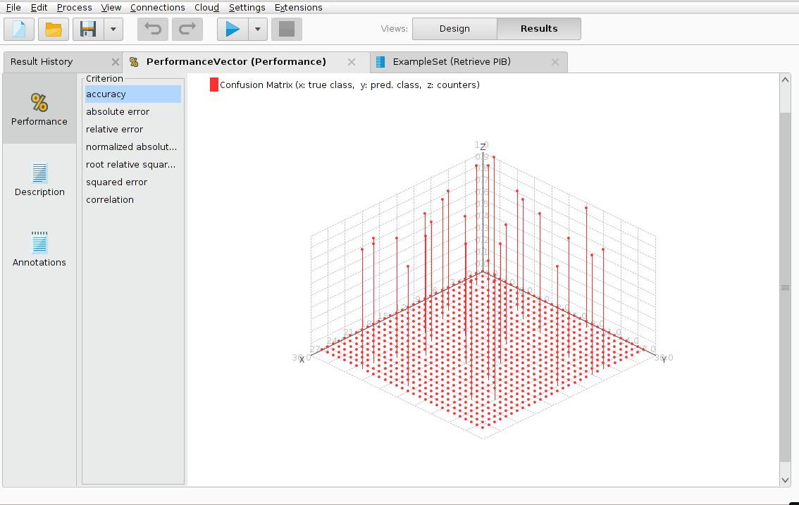

#Resultado 3

Para los errores de predicción la validación cruzada es muy útil ya que divide los datos etiquetados en conjuntos de entrenamiento y de prueba. Los modelos se aprenden sobre los datos de entrenamiento y se aplican sobre los datos de prueba. Los errores de predicción se calculan y promedian para todos los subconjuntos. Este bloque de construcción se puede utilizar como operador interno para varios wrappers (contenedores).

Dado que un valor futuro no está defino, su predicción con respecto a su rendimiento no siempre es exacta, existen casos donde este puede variar.
